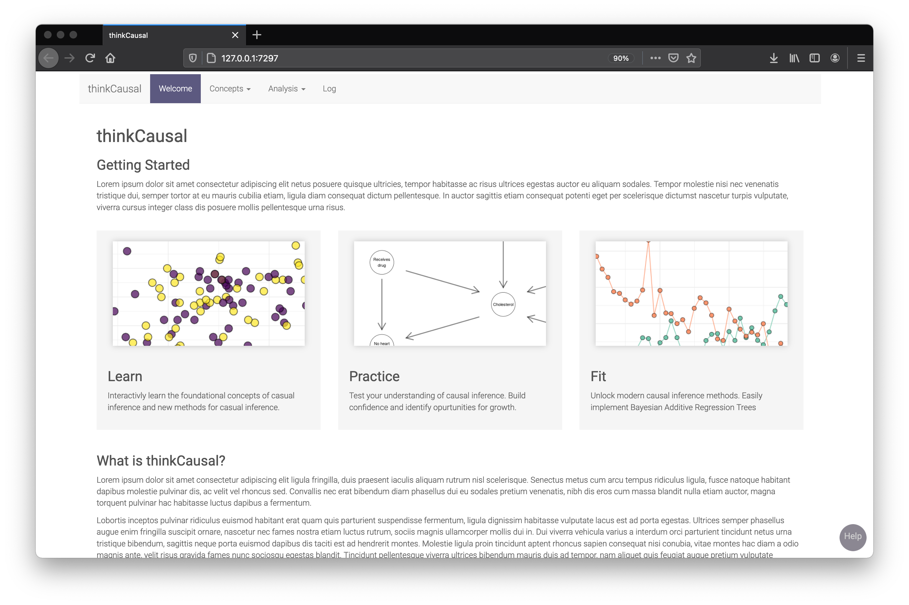

# Dev repo for thinkCausal

thinkCausal is federally funded project devoted to building scaffolded causal inference software implementing Bayesian Additive Regression Trees.

 

### Folder structure
    .
    ├── Concept_1           # Main project directory
    │   ├── data            # Test data
    │   ├── man             # Compiled manual for functions
    │   ├── R               # Functions
    │   ├── tests           # Unit tests
    │   └── UI              # Scripts that build the UI
    │      ├── concepts     # Modules that define each concept sub-page
    │      ├── headers      # UI code that defines the top nav bar hierarchy
    │      ├── markdowns    # Markdowns containing static text such as the help slideover
    │      └── pages        # UI code that defines each page
    │   ├── www             # Browser-side code such as CSS, JavaScript, imgs
    │   ├── DESCRIPTION     # Unused, default file for R packages
    │   ├── global.R        # Code that is run prior to launching the Shiny app
    │   ├── manual_workflow # Testing script useful for replicating the tool's workflow
    │   ├── NAMESPACE       # Unused, default file for R packages
    │   ├── server.R        # Server-side code for Shiny app
    │   └── UI.R            # Main UI framework
    ├── vignettes.Rmd       # Stories defining hypothetical users
    └── README.md
